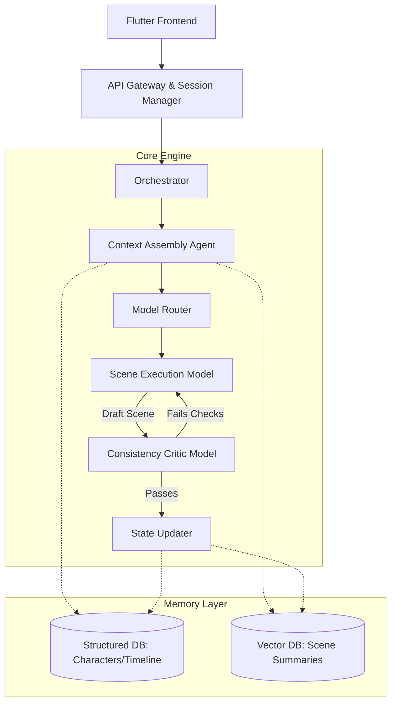

# LoreWeaver: Research-Grade Storytelling Engine Architecture

## 1. System Architecture Overview

To generate 20k+ words with strong narrative consistency, the architecture cannot rely on large context windows alone. We must model the story as a **State Machine**, where each scene is a state transition driven by an orchestrator, decoupling generation from memory retrieval and evaluation.



## 2. Memory Architecture & Data Schemas

Storing past scenes as raw text in a vector database leads to retrieval noise ("the character wore a red shirt once, so retrieve that scene"). We need a hybrid memory architecture separating facts from prose.

### A. Structured Memory (Graph / Relational / SQLite)

Holds the ground truth facts.

1. **Characters Schema**:
   - `id`, `name`, `core_psychology` (immutable string: 'stubborn, deeply loyal'), `current_state` (mutable JSON: `{"physical": "injured arm", "emotional": "grieving"}`), `relationships` (edges to other characters).
2. **World Rules Schema**:
   - `id`, `category` (magic, physics, politics), `rule_text`, `active_scope` (global, local, temporal).
3. **Timeline Event Schema**:
   - `id`, `sequence_index`, `location`, `participants`, `summary`, `causal_prerequisites` (e.g., event 12 depends on event 5).

### B. Episodic Memory (Vector Database - e.g., ChromaLocal)

Holds dense embeddings of the _summarized_ narrative beats, not the raw output.

- **Scene Embedding**: `scene_summary + emotional_valance`.
- **Metadata**: `participants`, `sequence_index`, `key_items_used`.

## 3. Context Retrieval Strategy

To support 50k+ tokens without coherence collapse, we assemble a 3-tier Prompt Context:

1. **Tier 1: High-Priority State (Always Injected - ~1k tokens)**
   - Fetched from Structured DB based on the _current active characters_ and _current location_.
   - Includes active `core_psychology`, `current_state`, and `World Rules` active in this location.
2. **Tier 2: Working Memory (Always Injected - ~2k tokens)**
   - The literal raw text of the _last N scenes_.
   - Crucial for maintaining stylistic continuity, pacing, and flow.
3. **Tier 3: Semantic Episodic Memory (Dynamically Retrieved - ~2k tokens)**
   - Before generating a scene, an LLM drafts the _intent_ of the scene.
   - `intent` string is embedded and used to query the Vector DB for past scenes.
   - Returned summaries are injected as "Relevant Past Events".

## 4. Prompt Engineering Strategy

We abandon the zero-shot "write the next chapter" approach. Generating a scene is a pipeline with strict constraints:

**Phase 1: Scene Planning (Model: Groq Llama-3-70B - Fast/Cheap)**

- _Input_: Current State + Working Memory + User Prompt.
- _Output_: JSON Scene Outline (e.g., Target emotional shift, required characters entering/exiting, required plot points).

**Phase 2: Execution (Model: Local LLM)**

- _Input_: The 3-Tier Assembled Context + JSON Scene Outline.
- _System Prompt_: You are an executor. You must literally follow the JSON outline while adopting the stylistic tone of the Working Memory. Do not introduce characters not present in the State.

**Phase 3: The Consistency Report (Model: Groq / Gemini)**

- Evaluates the output before returning to the user.
- Returns structured JSON detailing any violations.

## 5. Model Routing Logic

- **Local LLM (e.g., Llama 3 8B, Mistral Nemo)**:
  - **Role**: The Workhorse (Phase 2 Execution).
  - **Tradeoffs**: Zero API cost, great for creative writing and local atmosphere, handles bulk generation. Fails at deep consistency reasoning over long texts.
- **Groq (e.g., Llama-3-70B API)**:
  - **Role**: The Rapid Critic and Planner.
  - **Tradeoffs**: Extremely low latency makes multi-agent critique viable without destroying user experience. Handles fast RAG intent parsing and self-consistency checking.
- **Gemini (e.g., 1.5 Pro)**:
  - **Role**: The Synthesis Engine & Librarian.
  - **Tradeoffs**: Slower, but possesses a massive 1M+ context window and deep reasoning.
  - **Usage**: Runs periodically (e.g., every 5 scenes or passively in the background). Reads the _entire raw generated text_ to:
    - Re-align the Structured DB (Update `current_states`).
    - Generate precise Vector Summaries for the Vector DB.
    - Flag major long-term branching narrative errors that local models missed.

## 6. Evaluation Metrics for Narrative Coherence

Every scene output MUST come packaged with a Self-Consistency Report.

- **Trait Adherence Score (TAS)**: LLM-as-a-judge (Groq) compares character actions in the generated scene against their `core_psychology` in the DB.
- **Temporal Continuity Check**: Scans for "Zombie Objects" (e.g., referencing a destroyed sword or character). Evaluated against the Timeline DB's `causal_prerequisites`.
- **State Drift Rate**: Measures how many unprompted state changes occurred (e.g., character suddenly angry without cause). Too high = hallucination.

### Example Self-Consistency Output:

```json
{
  "scene_id": "sc_049",
  "approved": true,
  "metrics": {
    "trait_adherence_score": 0.95,
    "temporal_continuity_flags": 0,
    "state_drift_detected": ["sword lost"]
  },
  "justification": "Character strictly adhered to cowardice trait by running. New state added 'sword lost' pending State Updater review."
}
```

This architecture guarantees that _memory_ is not just "text I shoved into an LLM", but deterministic facts evaluated by fast, cheap models, executed by local unmetered models, and synthesized by deep-reasoning APIs.
